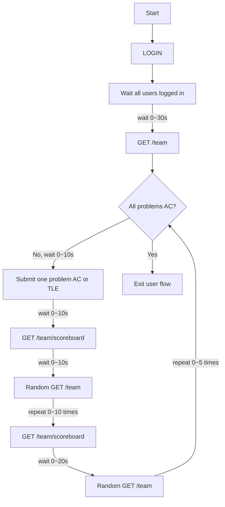

# Onyx

**Onyx** is a stress-testing tool for DOMjudge pre-flight checks. It helps identify issues early by simulating multiple teams logging in, submitting solutions, and polling key endpoints (e.g., team pages and the scoreboard).

> [!CAUTION]
> This program is still experimental. Use it in production at your own risk.

> [!IMPORTANT]
> **Authorized use only.** Do not run this against any system you do not own or operate, or without explicit written permission.

## Usage

1. Copy the example configuration and adjust it for your environment:
   - See `config.toml.example`

2. Prepare your directory layout. An example structure:

```

.
├── config.toml
├── solutions
│   ├── A
│   │   ├── AC.cpp
│   │   └── TLE.cpp
│   ├── B
│   │   ├── AC.cpp
│   │   └── TLE.cpp
│   └── C
│       ├── AC.cpp
│       └── TLE.cpp
└── team.csv

```

### `team.csv` format

`team.csv` follows the same format as **Natsume**: http://github.com/4o3F/Natsume

It must contain the following columns:

```

id,username,password

```

Example:

```

C22,team001,0d000721

```

> [!TIP]
> The `id` column is currently **not used** by Onyx (it is kept for compatibility).

## Logic

The simulation flow is:


